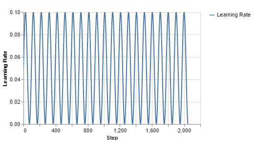

# Learning rate scaler callback

Learning rate scaler callback for @tensorflow/tfjs

## Installation

Package available via:

- NPM `npm install learning-rate-scaler`

## Usage

Module exports `LearningRateCallback` and example function `sineWaveRateScaler = (min, max, frequency, maxLearningRateDecay, earningRateDecayPerEpoch)` to use with it. (also a default `LearningRateCallback` scaler function).

- example 1

`LearningRateCallback` with defaults

```TypeScript
import {
  LearningRateCallback,
  sineWaveRateScaler,
} from "learning-rate-scaler";

const learningRateCallback = new LearningRateCallback()

const inputs = input({
  shape: [1],
});
const y1 = dense({ units: 1, name: "y1" }).apply(inputs);
let layersModel = model({
  inputs: inputs,
  outputs: [y1],
});
layersModel.compile({
    optimizer: train.sgd(0.001),
    loss: {
      y1: "meanAbsoluteError",
    },
});
const history = await layersModel.fitDataset(trainingDataset, {
  epochs: 1,
  callbacks: [learningRateCallback],
});
```

This would produce a sine-wave-looking learning-rate curve for each sample in the batch (for batch size of 2048 items with default settings).



- example 2

```TypeScript
const frequency = 1 / 25; // a fraction - fraction lim -> 0  produces wider periods.
const maxLearningRateDecay = 1.0001 // a number slightly higher than 1
const sineWaveRateScaler = sineWaveRateScaler(0.0001, 1, frequency, )
const learningRateCallback = new LearningRateCallback({scalerFunction: sineWaveRateScaler})
[...]
const history = await layersModel.fitDataset(trainingDataset, {
  epochs: 1,
  callbacks: [learningRateCallback],
});

```

This would produce a sine-wave-looking learning-rate curve with decaying of the initial max learning rate for each sample in the batch (for batch size of 2048 items with default settings).


Also it's possible to decay epoch-wise also by providing

```
const sineWaveRateScaler = sineWaveRateScaler(0.0001, 1, frequency, 1.0001, )
```

## Credits

Prepared by [Webplan.pro](webplan.pro) from different public sources. Feel free to use it as you need in your apps or send updates into this public repository. It's under MIT license.
